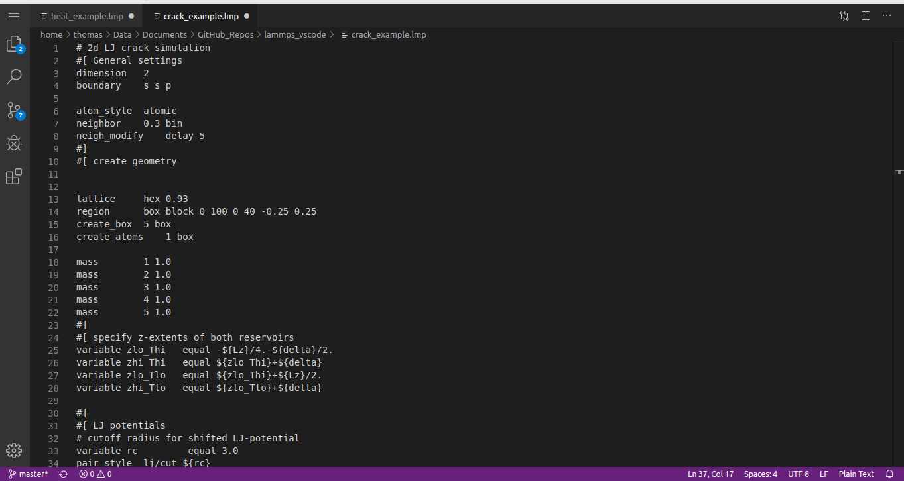

# lammps-lang README

This extension for Visual Studio Code provieds some basic syntax highlighting functionality for LAMMPS (Molecular dynamics Software) Scripts. It is based on the extension of Alessandro L. Sellerio for the KDE-Kate editor from 2012 as provided in the Lammps Repository: <https://github.com/lammps/lammps/tree/master/tools/kate>

## Features

- Recognizes .lmp, .lmps and .lammps file extensions
- Syntax Highlighting for Keywords, Variables and Data Types

## Known Issues

- The Keyword list is somewhat outdated.
- No auto completion
