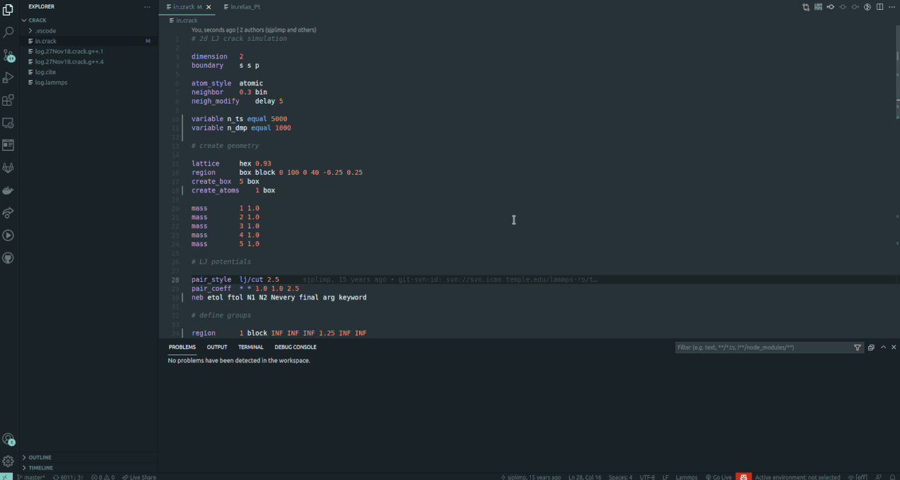
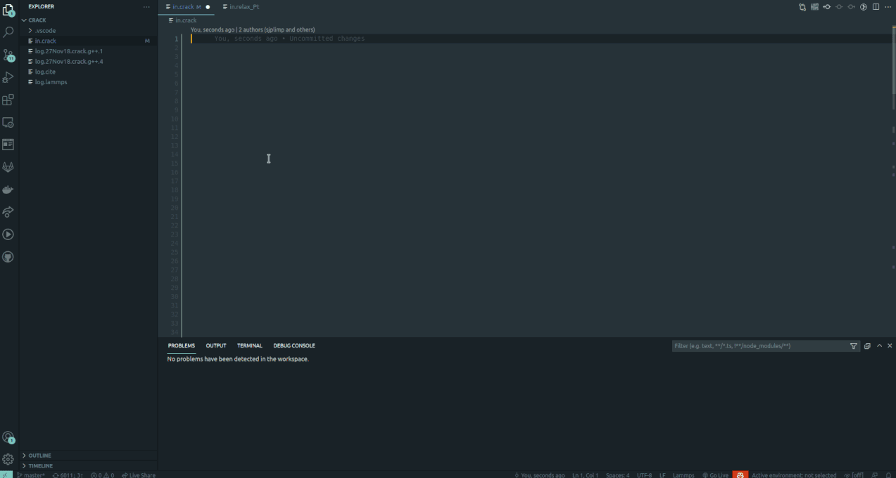
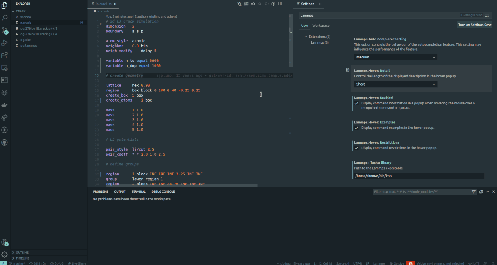
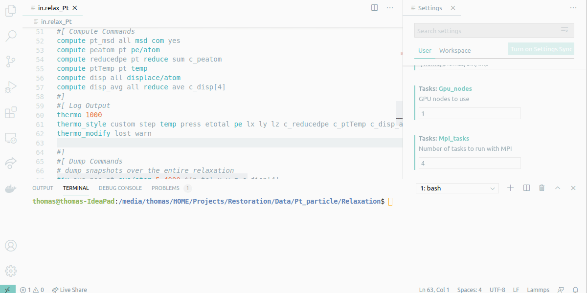
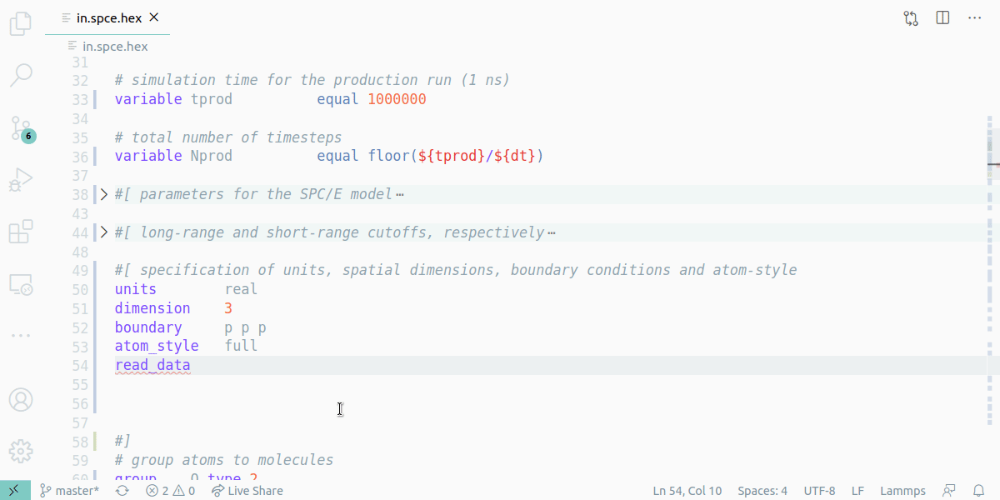

# Lammps language extension for vscode README

This extension for Visual Studio Code provides language support for LAMMPS (Molecular dynamics Software) Scripts.
This package is being synchronised with the Lammps documentation through a continuous integration pipeline on a monthly schedule to keep the keyword lists and embedded command documentations up to date.

## Features

### Syntax/Keyword Highlighting 

- Syntax Highlighting for Keywords, Variables and Data Types
- Keyword Highlighting for LIGGGHTS(R)-PUBLIC scripts supported
- Folding possible between Markers #[ and #]
- Recognizes .lmp, .lmps and .lammps file extensions and files beginning with "in."

### Embedded Offline Documentation 

- Right click on a command allows to open a documentation page inside vscode

### Autocompletion

- Completion suggestions with corresponding informations are displayed
- Functionality can be turned off
- Different information-display options possible 

### Hover information

- Information about Lammps commands are displayed when hovering over them
- Appearance of the hover panel is customisable

### Task Provider

- Differnt preconfigured run tasks can be executed
- Path to Lammps executable must be set in the extensions settings 
- Tasks of `"type": "lmps"` can also be configured manually in a tasks.json file

### Linting (in progress)

- Set of functions that points out problems before runtime
- So far only checking for files and paths on read- and write commands
- To be extended in the future

--- 

## Treeware License            
This package is [Treeware](https://treeware.earth). If you use it in production, then we ask that you [**buy the world a tree**](https://plant.treeware.earth/thfriedrich/lammps_vscode) to thank us for our work. By contributing to the Treeware forest you’ll be creating employment for local families and restoring wildlife habitats.
