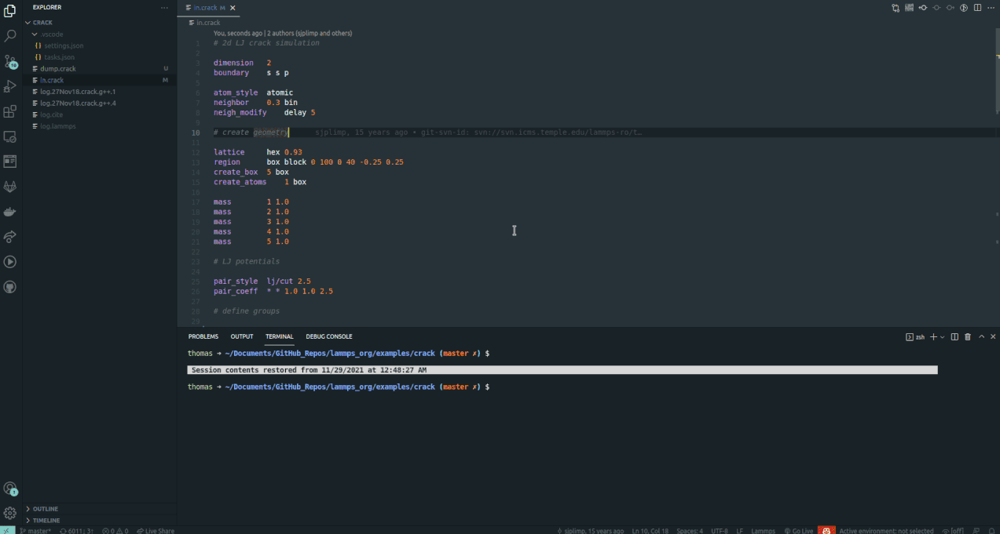

# Lammps language extension for vscode README

[![Plant Tree](https://img.shields.io/badge/dynamic/json?color=brightgreen&label=Plant%20Tree&query=%24.total&url=https%3A%2F%2Fpublic.offset.earth%2Fusers%2Ftreeware%2Ftrees&&logo=data:image/png;base64,iVBORw0KGgoAAAANSUhEUgAAAHYAAACyCAYAAACX3juzAAAABHNCSVQICAgIfAhkiAAAAAlwSFlzAAAPYQAAD2EBqD+naQAAABl0RVh0U29mdHdhcmUAd3d3Lmlua3NjYXBlLm9yZ5vuPBoAAA96SURBVHic7Z171F1FeYd/7/clMRewchEw3CKwwqLKTUW0KCQooAhLanVxqShoWVAUUSygXVRaWgS1AUHEFesqCtquVZRySQTaQAABkUuhmMhFYhJyUZobuREgJE//mP3Jzsk++zr77L3P2c9aWd/JOTPvvHt+Z+bsPfPOjNRSOcAQcDJwK7AE2AS8CMwFfhh8NiGLTSvL2UEDeIOk90vaR9J2ktZLek7Sw2a2vEsek/QxSX8v6e0JRayUNF3SN8xsdZI/rbAFAd4i6UJJn5S0Q0SSzZIeknSnpKckrZI0VtJ7JH1UyYJ2slTSuWb207w+tyQAnAKsphruBCZXXQd9B/APFQka5hXgW8BOVddHXwBcVLGgnawHvg3sOeJj+xubEeBUST9SPetuk6Q7JH1vqGpPmgQwVdIPVE9RJWlY0qGSXq6rg7UDOFjS3ZLeVLUvMcyRdLyZLWhbbAqAD0m6R/UW9RlJHzSzBZLUChsDMB64VNIMSW+s2p8YnpM01cxeqNqRWgO8AfgUML+am9xMbAAO6LyGUVVUXB0Btpc0VdJRkk6QtHO1HqXmcjN7svPNgb55AkZJOkvSpyUdLHdX2SRekLSPma3r/GBgWyywjaRbJB1ZtS8F+FqUqNKAtlhgtKRZkg6v2pcCzJV0oJltivpwUO+Kv65mi/qapDO7iSoNoLDAkZK+XLUfBfmamT0Ql2CgumLcxPbjkg6s2pcC3CjpJDPbHJco9uYJGJLrsg6R9KeSxkuaJ2mGmT3oydFecrSaKyqSrpJ0fpKo3S3ABODzwLMxD8Y3A7t6db1kgBvLHCkogXXAvcA0INMXcouuGNhD0hmS/lrRYR6drJE0Ta57+J2kcXIxP5MlbSNpiaRfdYv56SXAWEnL5PyqO69JukzSZWa2IZcF4M3AmcBsXHScbzYC1+FigyoDeG8J11YWF/m44Kt65Owi3NRXJQBn9eg6i7Ic17sUYkjSFyVdW7zqEtlN0h3A7j0oK4qqys3K7Wb2clEjQ2aGpHMl3Vvcp0R2kvQzYEwPyupk+wrKzMOvfBgZkiQze00uLrbwNyUFh0i6uAfldNKUAX4vj5F/HHkys8WSvu/DaAouBI7uUVkjRA6W14ylkp7wYahzSPFbkjb6MJzAsKSbgF6O167qYVl5mZ578KGDLYQNWu1NPgynYIKk/wbOwY1wlc2zPSijCE/INSwvRFXoP6o3rVaSxki6WtLDwEm4hU1l8XSJtotyu6Sjcg9GRBA5CQB8U9L5vgrJwHK5FWX/bGYv+jSMi5ZYoXoEpW2Su/udLfd4EztT4w1gmGrHVZ8EvAuAW39aJctxAyU7+r62LJUwDJwG3E05Q41JXF/CNZ1TwXWM8BTQswC5VPOxwNvk1oTsVq47WxYr6TAz+6U3g65iF6v3sV6bJO1vZk/1qsBUd6NmNlfSV0v2ZatiJZ3t1aALqL7dp82UzOylqFK20JiZpXnRnROA8Z5tXufZXhru6nWBqYU1s1WS1pboSxTbSHqnZ5u3yq1z6SXze1xe5mC2nnYnAfv4NBZE9l3u02YKlvW4vMzC3leKF/GU8dz5E0nPl2A3irlyAXQ9Jauw0+QGqnvJSyXYnCKpFxEdz8mtV32lB2VtQSZhzewPctvY/EzSq6V4tDW/92kMOEjSTyWN9mm3g2VyQekHm1nPf1+lAnHFwA6STpf0FaULfMvLJDNb6MMQMFHSI5Im+rAXYqXc/cf9wb9ZPqIgilA4YBzYW26DqjKGyeab2V4+DOHW68yWdFjEx/MknSL3ez5K0rZyExQT5CIvJWlkgH5k+m+1pEWSFppZGT8X1QOcW9Iw3JUefYwL2jvOVzl9BXBgScLu78m/42PKuM1HGX0JsEcJot7jybedgRe6lLEB8NLV9yXAOFxguE+8hM0At8WUcYmPMvoa4OseRb3Fk08nx5SxFLeqvSUO3GbKf4fb168IawjtCVjAn+3p3gUDnOHjugcGYBfgPOBB8nXPZ3nyY3pMGXOApsQZ56LUhc/AOLnZmXdI2kvSW4N/b5Hb5SxqwvsYM/uvguXuLzc+2028j5jZz4uU0RIDsC3ujvqIjtZUKMIBt0lzN2b78r8lBcBvQpWfO3ICODahqz/Cp98tCQBXhyp/BW6ntKw2hoFfx4g6qwzfW2Jg69GhaTlsJK2BfV8ZvrfEgPu9fTUkwgYyrIIHRgMLYkQtdEPWUgDg/g4xvpkh718ltNb3l+l7SwzAJR1irCHFby3ut/W3MaJ6WUzcJOq2M9tDHf/fVtI5KfKdqPigtytye9RSHGAHYHNHa1sBbBuTx3BrfbqxCDfJ3lIlXbrUz8Wk/3CMqAB/00v/W7oA/DhCnK7hm8DMGFHXAn/SS/9bugB8oYtI74pIuw/xKwH/tYprqAN1u3mStr6BGuGUiPc+p/hrGFhhawfuBI2XI1rfQty2tCPpxgOrYlrrs+H0g0btWmwQNb/VqRSS9pAU7o4/pvgDjn4YbE42kNRO2IA5Xd4/KvT6tJj8myXd4M2bBlJXYX/T5f0p0h+3350ak/9+M1vk26km0TRh/ww3Cf+Xive9ikXaLUkAk2JuivYFHo/5HGC/qq+hJQLcMOHaLqKdlyDq76r2vw7UsisO7ma77aR2QUL2GZ7daSS1FDag2+9s0l5JVewKUzuaKGwcm+Vpv9+m02/CzjGz1d49aSB1FjbPbqWPeveiodRZ2Ofltt3LwtwyHGkitRU2GDPOeuZ4nu67L6mtsAFZ92KaV4oXDaTfhO31HlS1pe7CZtkGaI2ZrS/Nk4ZRd2EXZ0jbhONXekbdhc3SYvtzr6Wc1F3YLL+xXc8rH0T6Sdhebwdfa2otrJktU/outhU2RK2FDUgb4tIKG6IJwi5Jma5dnxOiCcKuTJmubbEhWmH7lCYIm/Z40LYrDtEEYdO22FbYEE0QNm2LHUW5x5Q2iiYIm7bFSu4Apha1wvYt/SbshNK8aBj9JmzbYgNaYfuU2gsbREWkjVZshQ2ovbABaedau+4HNWj0m7DblepFg2iKsK+lTNcKG9AK26f0m7CZdyXvV1ph+5SmCJv25qkVNqApwrYtNiNNETatn2WePN0omiJs2hGlHSl4GFO/0BRh087aDKlttZIaIGwQFZEl7CVpV5mBoPbCKvvA/k6leNEwmiBs1snztsWqGcJmbbGtsGqGsFkPa0h9bFo/0wRhd8uYftdSvGgY/Sjs7qV40TCaIGxWobJ+EfqSJgibuSsGmnBdpdKECsjaYkerfZZthLBxp0x2Y+C741oLC+wuacccWVthq3YggYNz5muFrdqBBA7Kma8VtmoHEjgkZ76Bf5atrbDBhPnhObNP8uhKI6mtsJLeK+mNOfPu5dORJlJnYT9eIO8uwEAv0KqlsMAYRR8EnIXDfPjS4hHgjIRjztLwe2Bi1dfSEgDsBizzICzA/wLtep6qwZ1C+YwnUUd4CGj3pqgK4HhgiWdRR/g50G7w1UuAw4A7ShI0zExgfNXX29cAewJfwP0GdmNlCeL+EsgzqdASBTAO+ABwKfA/KQRYC/xtCcICLAQOrbpOyqaUdS7AWEmHSpoS/HuPpLEps78i6c8lHVGGb5L2kHQf8BVJV5nZ5pLKaT7AKOAI4GJgNrAhZ2taARwe2LyraNNMwaPAu6uuv1oBDANHA/8CLPdQyQ8Ae4bsL41J+ziwyEOZAJuAf2MAuudYcK3zVODpjBU4H9ciO1kBnA0Mh8p4U4yde4DtgRkxaa4FLgHWZfTxEeAzDNo4M/BuYG5C5awM0swCrgQ+BZyCa2Vh5gNfAraawQEO6WJ7BsHzKHB5jA/fCNJMBG5K8DeKNbie6IBe13HPAS4CNoYufiXwE+AcYAqwN+6mqTPf2cCroXyPAycTs0AZOCGisl8Gdg6l+WSMMNM77J0KrMoh8CbgOqD/IjKAIWB6cKHrgOuB43AzMHH5DLgsVEkrgTNJEfOL+zJ0cn1HmoNiBJkZYXNX3CBFHtYDFwCWvQZrSiDOS8A0IHW8bujLAK4LzZL3nyIq910dacayZQ8S5g8xtk/FPcvmYSbQ/BXzwAeBW4FMK9iAC4OKeAU4L+s3HfhuR4VGnnEHPBUjwqQY+2NwvUKeCYfngbdnuZ7aAUzNIcoJuN+mFcCUnOXe0FGZ13dJ9x8xApyUsqwDcHfQjwV+p2E5g3BjNQKwM24udR6wbwE7t3ZU5Ge7pLs4pvJvyFHuDsDHcT1G0t3/ImAwlmwC/4l7vi10wbhHpTCRgwfAX8RU/CoKTtUFX9QTge8R3e3fRb8vAAOODS5+Fw+2ZndUYOSMDLBvQqv6aFFfOsp7G+7xJ9xln+azjFqBG42aRcwNS0Z794YqbnVMumHix6Vv8eFPRLkfwT0CASwgNGrWVwCfAPJG7UfZuz8kzjMJaTtHtMJs9PVliyj3E6FyPlRGGUXw9fuw2swe8WRL2tKvpFM85sR8NkrSBcXd2Rozu1HS3cF/jymjjCIUFhb3wD7Lgy9hwl1b0tl2ccJK0ulAWSsDLg3+7l+S/dz4aLGrSpisztJi54ZevyTp1x2fj5X0HR9ORfALSatVw9NDCgtbUgTCq6HXWVrsWLk1P5+RtDj0/rFAkSUjkZjZRkmPyYlbK+r6DLY+9PrFhLQL9XrFDknay8yuk7SfpBtD6a6hnEC2RZKeLsFuIeoq7Euh17Et1syQ9GTorcnB++sknSjpq5I2y23Fd7VfNyU5X2eUYLcQdRU23GLTHAwcFvbAkRdmhpldLun84K2TyTl+HcMivX53XBv6RdhHQ6+32rfCzK6QdGXw38sK+BXFj8ws7ZkFgw1wTejhP3HgA5gcSr+4S5rRwBNBmr4PXKtriw1HZ8SOPAX8VtKy4PWuREzqB3ewn5U72fLIwh7WnLoKOy74u9TM1iQlDm6g7gu9FbmNkJk9JulmDcDWt3UVdu/g78MZ8twWev2OmHRXSFqb2aOGUdejTEYm6e/MkGem3Ilaw4rf+OsBSW/O6VdLXnCLn0eYlDHvL4J8SxLS9f0q9zp2xVOCvw+a2YKMeUe644nA5G6JzCzNI1SjqbOw1+bIe7NeP899qhdvWoqDi4j4P1wwXK54JV5fpffvvv1ryQnwvkCU0wvYGFkespKE1QotPQIX9vkIBSL/cEtS5tU1ZGXgwC3ZWEbHUo6ctr4YCPsDH761FAAXv3uNJ1tjcPHNy9ruuGJwi768bdcDHBO02k/7stmSEdwSx/1KsPtjYA79tPyxSZTVXQLjcdsPHVeG/ZYKwW26eRMwLjl1S6MAtgueb+s40lYK/w/F5a21eb8MVAAAAABJRU5ErkJggg==)](https://plant.treeware.earth/thfriedrich/lammps_vscode)

This extension for Visual Studio Code provides language support for LAMMPS (Molecular dynamics Software) Scripts.
This package is being synchronised with the Lammps documentation through a continuous integration pipeline on a monthly schedule to keep the keyword lists and embedded command documentations up to date.

## Features

### Syntax/Keyword Highlighting 

- Syntax Highlighting for Keywords, Variables and Data Types
- Folding possible between Markers #[ and #]
- Recognizes .lmp, .lmps and .lammps file extensions and files beginning with "in."

### Embedded Offline Documentation 

- Right click on a command allows to open a documentation page inside vscode

### Autocompletion

- Completion suggestions with corresponding informations are displayed
- Functionality can be turned off
- Different information-display options possible 

### Hover information

- Information about Lammps commands are displayed when hovering over them
- Appearance of the hover panel is customisable

### Task Provider

- Different preconfigured run tasks can be executed
- Path to Lammps executable must be set in the extensions settings 
- Tasks of `"type": "lmps"` can also be configured manually in a tasks.json file

### Linting (in progress)

- Set of functions that points out problems before runtime
- So far implemented: 
  - checking for files and paths on read- and write commands
  - checking for unbalanced/non-closed brackets
  - checking for exceeding maximum # of group definitions
- To be extended in the future

### Simulation Dashboard (beta feature)

 - Shows system information like CPU,GPU(Nvidia only) and memory usage
 - interactive 3D Visualisation of atomic dumps
 - interactive plots of lammps log file data
 - automatically updating plots for easy live observation of simulation status
--- 

## Treeware License            
This package is [Treeware](https://treeware.earth). If you find this extension useful, then we ask that you [🌱 **buy the world a tree**](https://plant.treeware.earth/thfriedrich/lammps_vscode) to thank us for our work. By contributing to the Treeware forest you’ll be creating employment for local families and restoring wildlife habitats.
