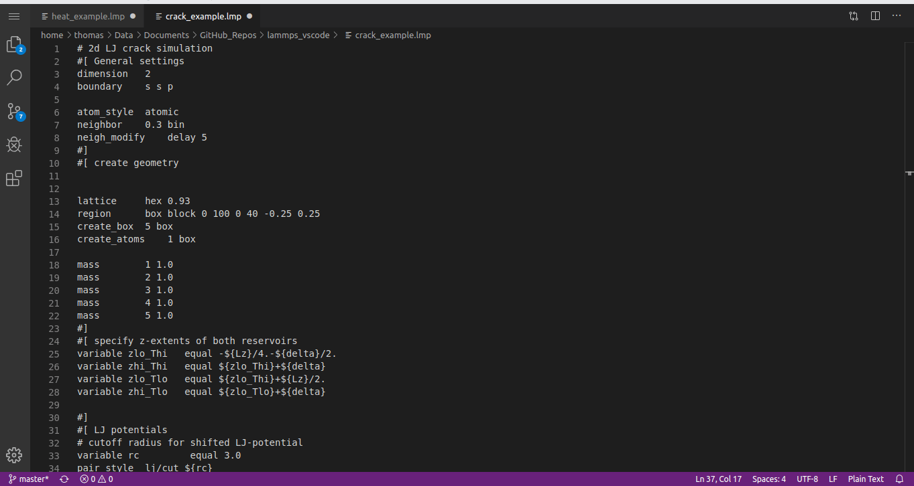
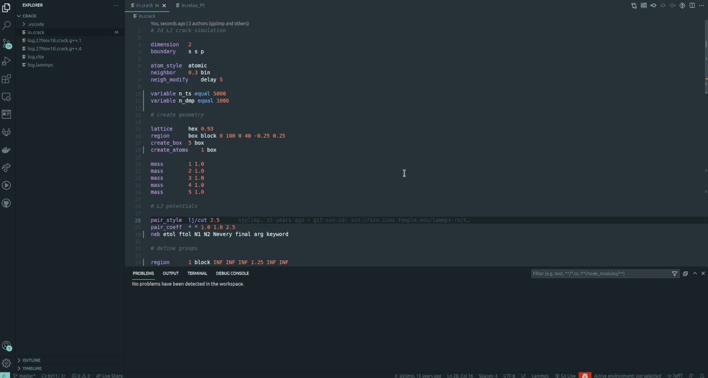
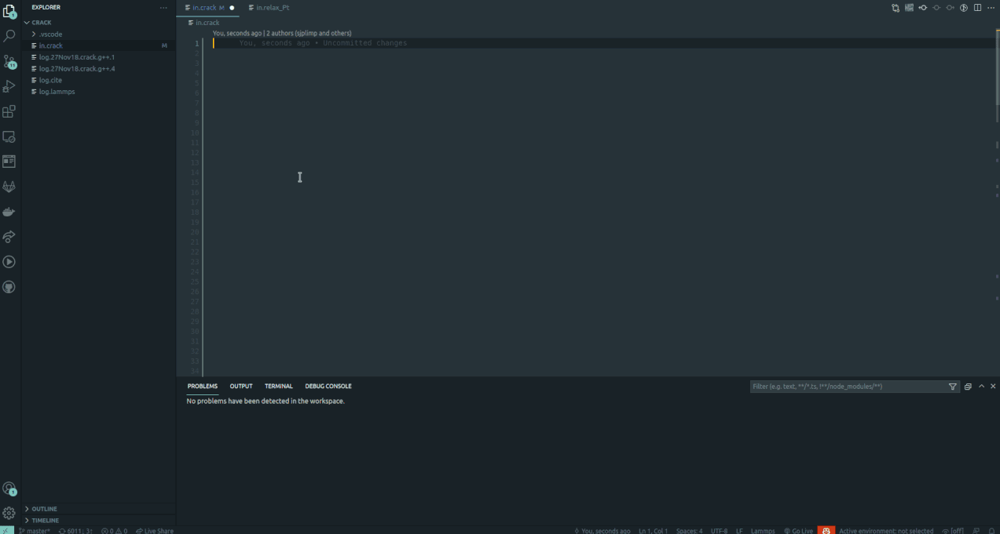
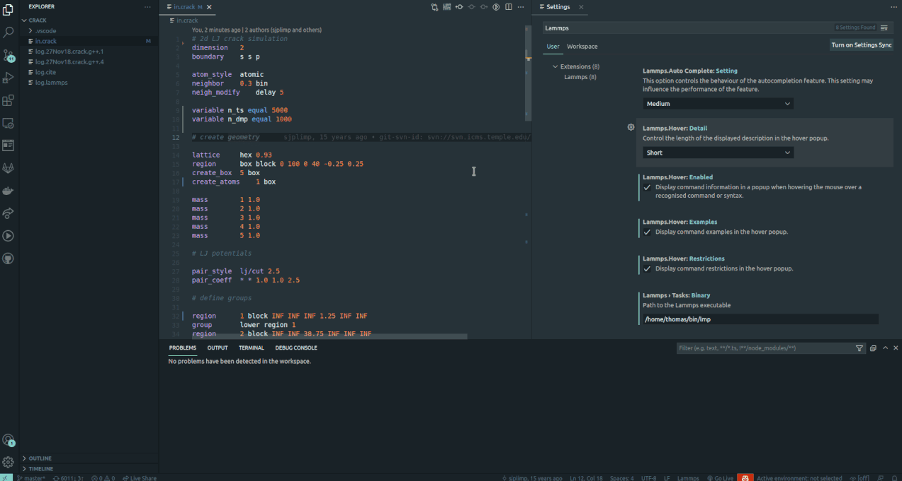
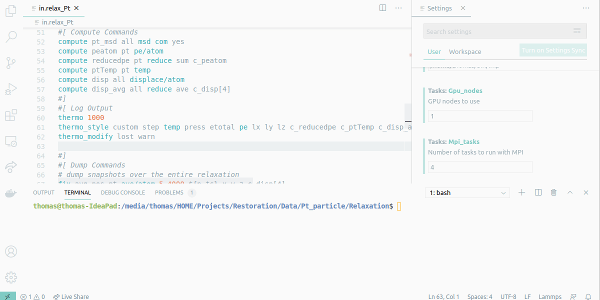
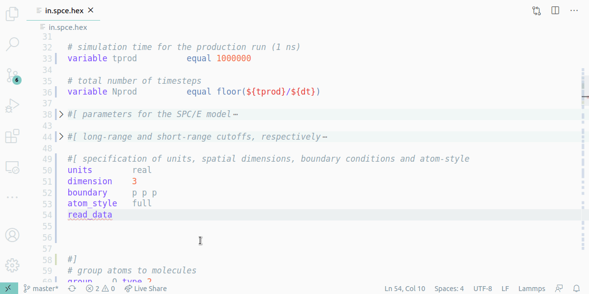
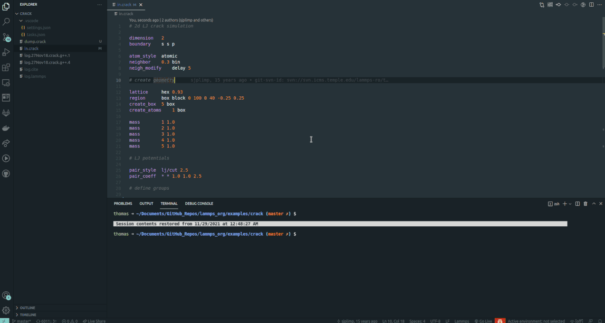

# LAMMPS Language Extension for VS Code

This extension for Visual Studio Code provides language support for LAMMPS (Molecular dynamics Software) Scripts.
This package is being synchronised with the Lammps documentation through a continuous integration pipeline on a monthly schedule to keep the keyword lists and embedded command documentations up to date.

## Features

### Syntax/Keyword Highlighting 

- Syntax Highlighting for Keywords, Variables and Data Types
- Folding possible between Markers #[ and #]
- Recognizes .lmp, .lmps and .lammps file extensions and files beginning with "in."

### Embedded Offline Documentation 

- Right click on a command allows to open a documentation page inside vscode

### Autocompletion

- Completion suggestions with corresponding information are displayed
- Functionality can be turned off
- Different information-display options possible

### Hover information

- Information about Lammps commands are displayed when hovering over them
- Appearance of the hover panel is customisable

### Task Provider

- Different preconfigured run tasks can be executed
- Path to Lammps executable must be set in the extension's settings
- Tasks of `"type": "lmps"` can also be configured manually in a tasks.json file

### Linting

- Set of functions that points out problems before runtime
- So far implemented: 
  - checking for files and paths on read- and write commands
  - checking for unbalanced/non-closed brackets
  - checking for exceeding maximum # of group definitions
- To be extended in the future

### Simulation Dashboard

 - Shows system information like CPU,GPU(Nvidia only) and memory usage
 - interactive 3D Visualisation of atomic dumps
 - interactive plots of lammps log file data
 - automatically updating plots for easy live observation of simulation status

--- 

## Plant a Tree            
If you find this extension useful, please consider [🌱 **planting a tree**](https://ecologi.com/treeware) to thank us for our work. Donations go directly through [Ecologi](https://ecologi.com) via the Treeware forest, funding reforestation and climate projects that create employment for local families and restore wildlife habitats.
