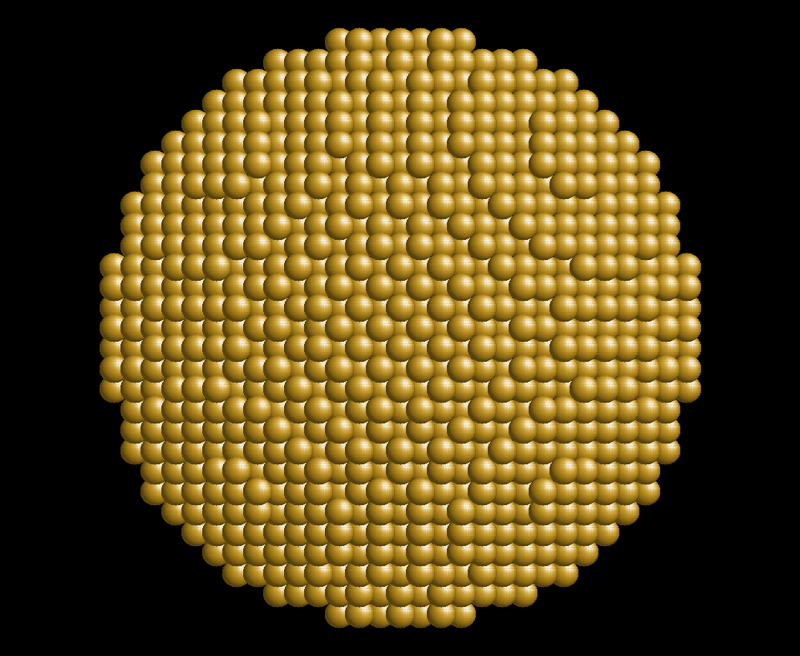

# Summary

Lammps_VSCODE is a extension-package for Microsofts popular code editor ["Visual Studio Code" (vscode)](https://code.visualstudio.com/) that supports materials scientiest working with the molecular dynamics software [LAMMPS](https://www.lammps.org). LAMMPS is an extensive, open-source molecular dynamics code with nearly 1000 high-level commands in its scripting environment. The code is constantly evolving with more than 250 contributors and regular release cycles. Using and understanding the these commands in LAMMPS-Input scipts can be challenging, especially for beginners. Lammps_VSCODE provides an interface to LAMMPS and its extensive documentation and script syntax and implements functionalities such as syntax highlighting, tooltips, embedded offline documentation for all LAMMPS commands, autocomplete suggestions, a limited number of pre-run-checks and a simulation dashboard with interactive plotting of log-data and 3D-visualizations of atomic structure files. The extension is being updated automatically through a continuous integration pipeline on a monthly schedule to ensure ongoing compatability with the latest official LAMMPS release.

# Statement of need

LAMMPS stands for "Large-scale Atomic/Molecular Massively Parallel Simulator" and is a classical molecular dynamics code. The development began in the 1990s at Sandia National labs [@Plimpton1995] and continues to this day as an open source project with a large number of contributors and an even larger number of users. The scripting language used for setting up LAMMPS simulations has 1387 documented commands in the release branch of the GitHub repository at the time of writing and several [parsing rules](https://docs.lammps.org/Commands_parse.html), which add a layer of complexity. The actual scripts are usually not particularly extensive and consist of [four main parts](https://docs.lammps.org/Commands_structure.html):
 1. Initializations
 2. System definitions
 3. Simulation settings
 4. Simulation execution
However, 
scientific publications [@Thompson2022; @Kloss2012] Online Tutorials [@Fahim2022; @Mihok2022]

# Figures

Figure sizes can be customized by adding an optional second parameter:

{ width=20% }

# Acknowledgements

I want to acknowledge contributions from Arnaud Allera and Felix-Justin Friedrich who actively worked on the code, and the many GitHub-users who contributed enhancement-ideas and bug-reports. I am particularly grateful for the anonymous donations to [Ecologi](https://ecologi.com/) through the [Treeware license](https://treeware.earth/) of __Lammps_VSCODE__.

# References
